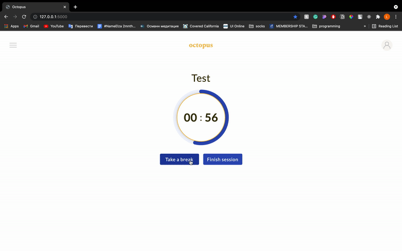

# OCTOPUS THE TIMER
A timer&todolist web application using Flask
## DEMO PREVIEW

## FEATURES
- progress circle timer with the option to pause it and add heading
- tracking of the finished sessions' duration and name in the account history
- todo list with "complete" and "delete" options

